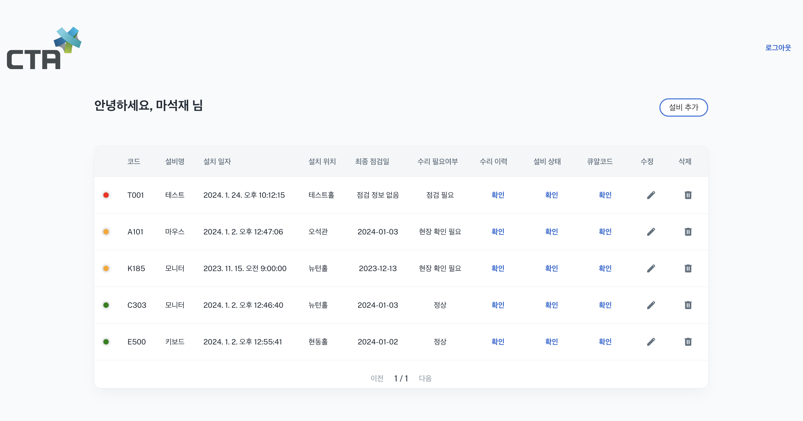

# Project introduction 

> Main Page Preview

## Startup settings
### Dependencies setting command before starting the project
- `npm install` / `yarn install`

### Project start command
- `npm start` / `yarn start`

## Developer contact
Email: maasj7514@gmail.com

## License
MIT License. Here, [URL](https://github.com/minimal-ui-kit/minimal.free/blob/main/LICENSE.md) for more information.